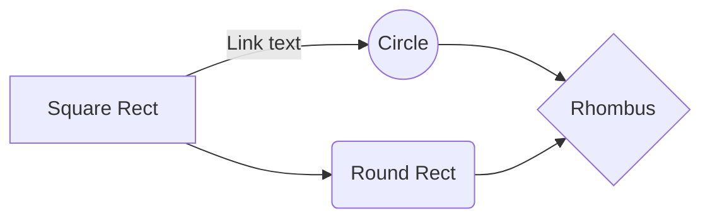

# VEEAM-ZIP
### Build Environment
* Veeam 9.5 Free Sp2
* Powershell 5.1.15063.0

### 1. Contents
### 2. Script File Usage
* veeam-zip.ps1
### 3. Permissions
### 4. How to use

```mermaid
graph LR
A[Square Rect] -- Link text --> B((Circle))
A --> C(Round Rect)
B --> D{Rhombus}
C --> D
```
